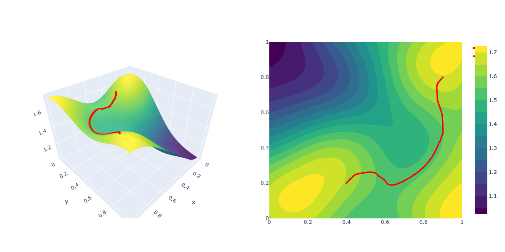
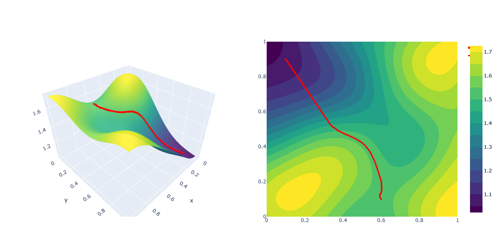
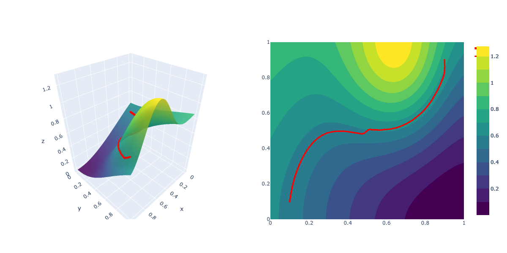

# What is a SEMES ?

SEMES are study weeks organized by [AMIES](https://www.agence-maths-entreprises.fr/public/pages/activities/SEMES.html)
based on the European Study Group model: an open problem proposed by socio-economic partners is presented on Monday 
to a group of four people, with a final presentation delivered on Friday of the same week. Young researchers are asked 
to explore original response strategies for the company. The objective is to 
allow young researchers to tackle a problem from the socio-economic world, work as a team, and produce original solutions
within a short timeframe. Furthermore, SEMES allow participants to expand their professional networks.

## The project:  Energy-efficient navigation of a terrestrial robot in an uncertain environment

This project has been developped during the SEMES at La Rochelle from 24 to 28 November 2025.

This work aims to develop methods to minimize the energy consumption of the Jaguar, a ground 
robot developed by [SFYNX INDUSTRY](https://sfynx-industry.com/), in order to ensure energy-efficient navigation even in uncertain
environments. For context, the JAGUAR project is a robotic platform designed for transport and support in the field.

## Assumptions and modelling

The robot operates within a square area defined as $[0,1]^2$. The core objective is to find a path $\gamma\colon [0,1] \to[0,1]^2$
between a starting point $p$ and a final point $q$ that minimizes an energy functional $E(\gamma)$. The total energy is 
expressed as a weighted sum of different physical costs, primarily given by friction and gravity.

The environment is characterized by two primary functions:

- **Height Function** $(x,y)\mapsto h(x,y)$: Maps every coordinate to an altitude (modeling mountains, slopes, or cliffs).

- **Friction Function** $(x,y)\mapsto \alpha(x,y)$: Maps every coordinate to a local wheel-ground friction coefficient (modeling surfaces like grass, sand, or ice)
 

The total energy $dE$ required for movement is defined by the work of the motor force $\vec{F}$ over a distance $d\vec{\ell}$:

$$dE = \vec{F} \cdot d\vec{\ell}$$

To move, the motor must overcome two main external forces:
- **Frictional Force** $F_f$: Its intensity is calculated as:

$$ F_f = \alpha \, mg \cos(\theta) $$

- **Weight Force** $F_w$: The gravitational component acting on slopes. Its work depends on the gradient of the height function:

$$ \vec{F}_w \cdot d\vec{\ell} = mg \, \nabla h(\gamma(t)) \cdot d\vec{\gamma} $$
 

Once we express the energy functional in terms of the path $\gamma$, we minimize it through a gradient descent method using
the jax library.

## Numerical results

  
  
  
   
  <em>Plot of the path with different height functions. The friction here is constant.</em>

